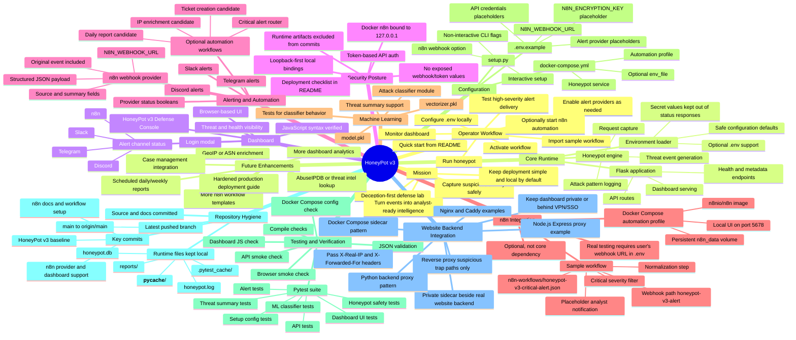

# HoneyPot v3 Mind Map

## Quick mental model

HoneyPot v3 is organized around one main loop:

1. Attract and capture suspicious traffic.
2. Normalize it into structured threat events.
3. Display operational status in the dashboard.
4. Send high-value alerts through optional providers.
5. Use n8n only when automation is desired, keeping the core honeypot lightweight.

## Best next branches from this map

- Automation branch: add more n8n workflows for enrichment, ticketing, and daily reporting.
- Security branch: harden production deployment docs and secret handling checks.
- Intelligence branch: improve ML classification and attacker behavior summaries.
- UX branch: add richer dashboard charts and incident drill-downs.
